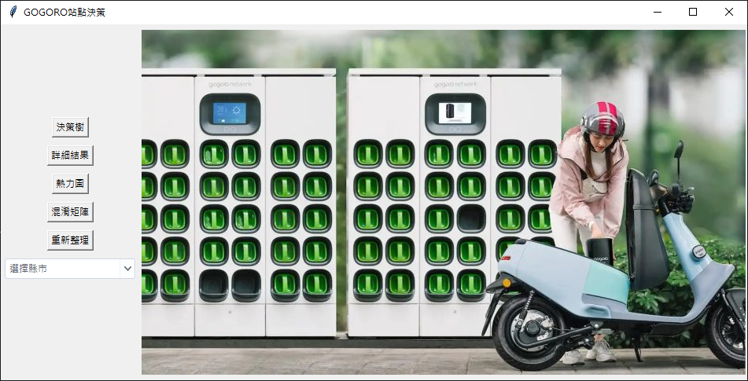
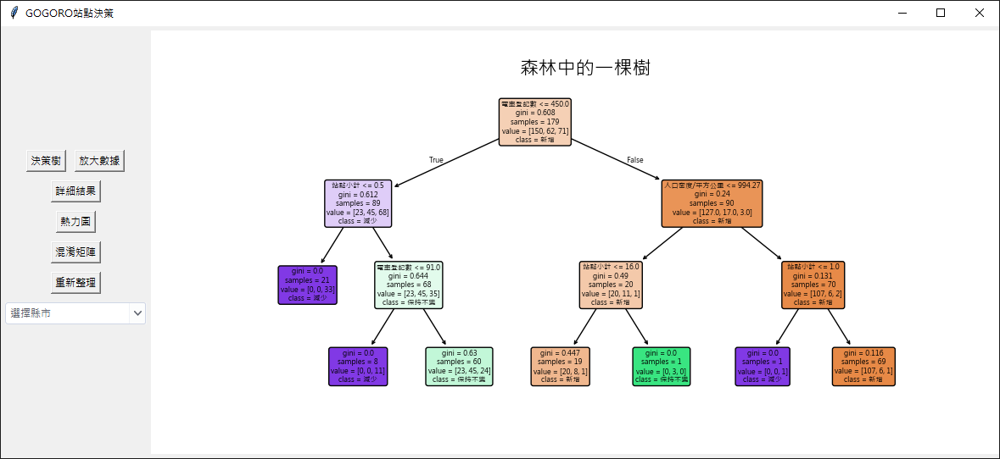
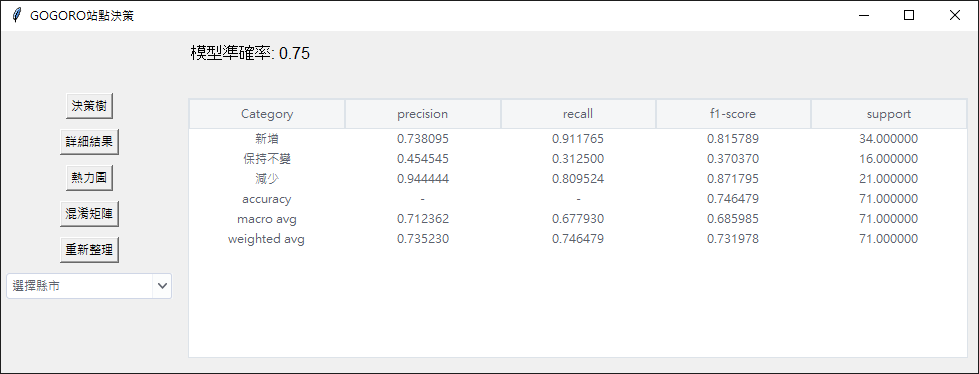
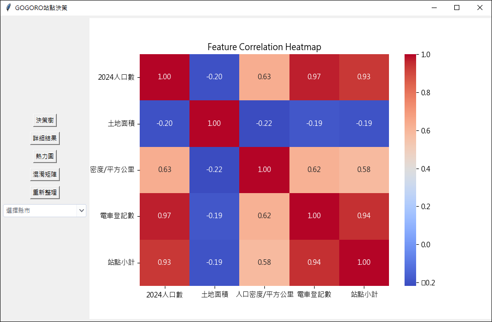
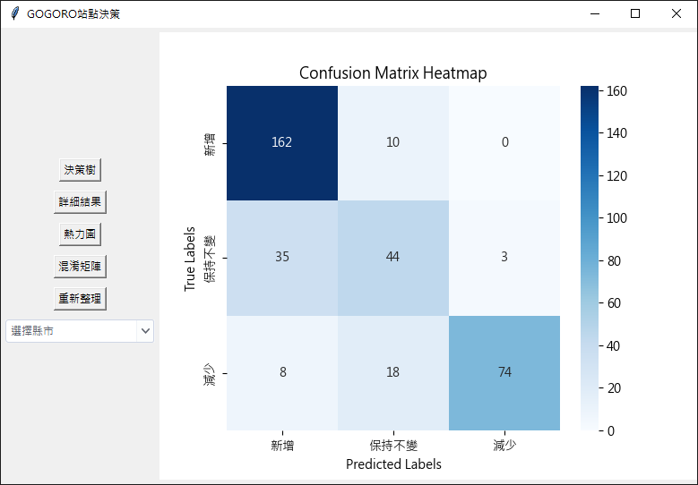
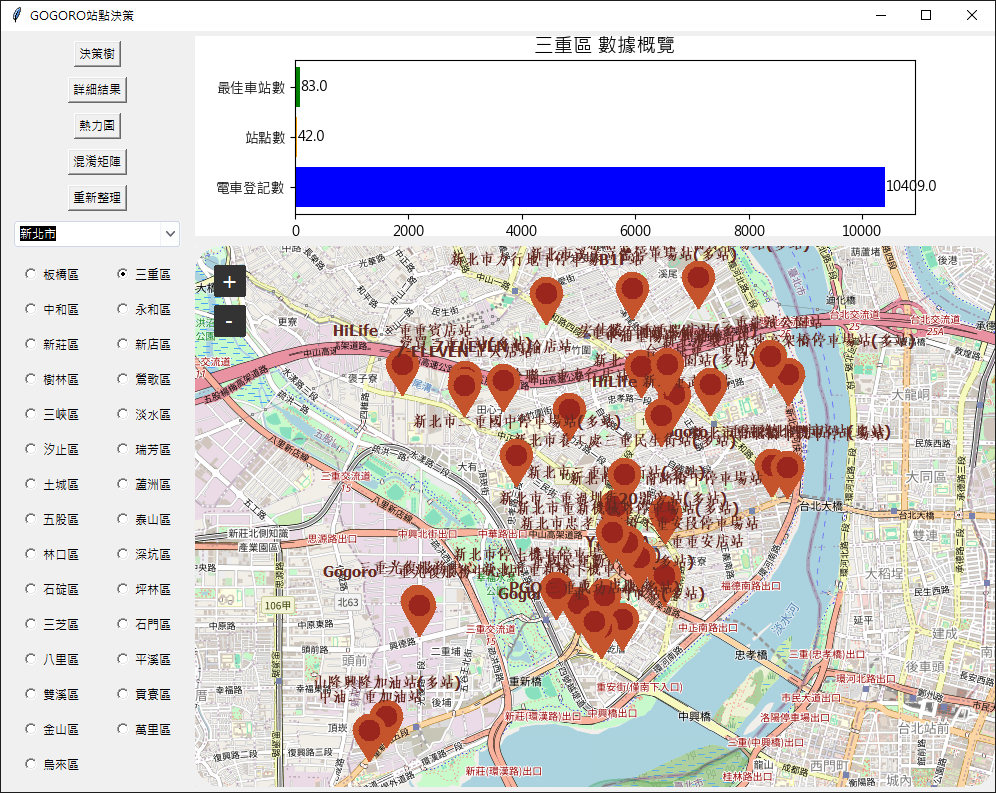

# GOGORO_dec
因應台灣推動2035年新售機車全面電動化，因此我們希望透過機器學習了解各縣市最大宗的電動機車充電站是否能夠負荷這個要求。
In response to Taiwan's push for full electrification of new motorcycles by 2035, we aim to use machine learning to assess whether the most widely used electric motorcycle charging stations in each county can meet this requirement.

### 封面

### 決策樹

### 預測報告

### 特徵熱力圖

### 特徵混淆矩陣

### 站點所在地圖跟數量長條圖

